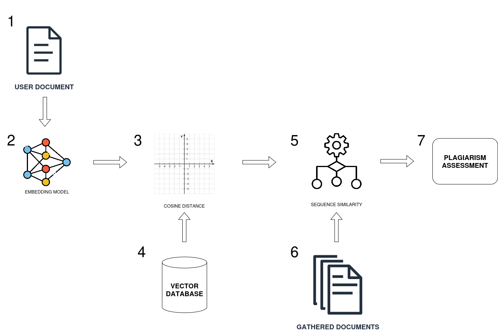
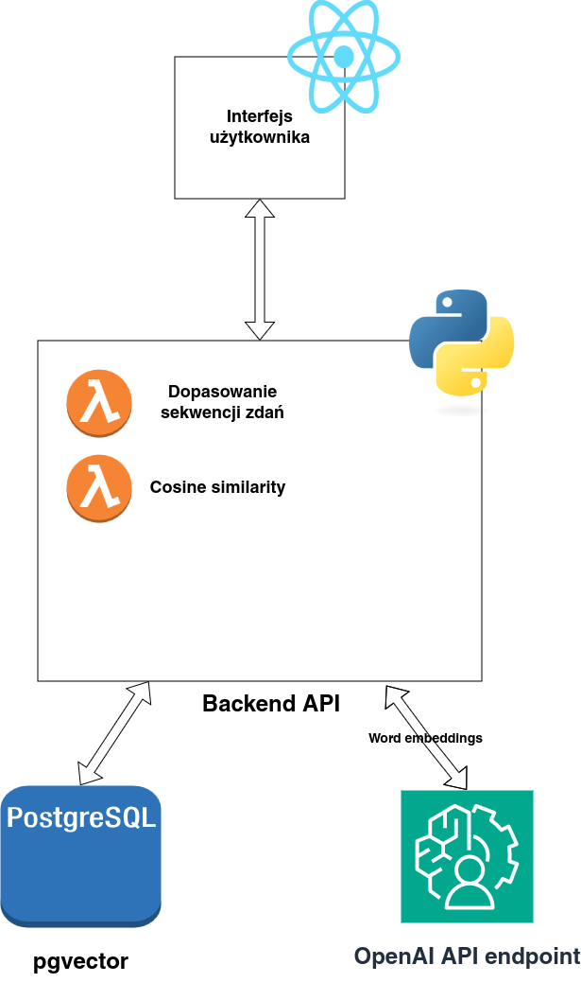

# Martial.AI

Projekt ma na celu wykonanie systemu do oceny plagiatu w tekscie zadanym przez użytkownika. 
Na podstawie tekstu obliczane są liczbowe reprezentacje zdań które są następnie porównywane z reprezentacjami zgormadzonymi w bazie bazie danych.
Zaletą zastosowanego podejścia jest możliwość wykrycia plagiatu popełnionego poprzez tłumaczenie tekstu w innym języku.
Liczbowe reprezentacje zdań zawierają informacje o znaczeniu tekstu bez względu na język tekstu.
Wyniki oceny plagiatu są wyświetlane w interfejsie użytkownika napisanym w języku JavaScript z użyciem framework React.
Komunikacja między interfejsem użytkownika a serwerem webowym jest wykonywana za pomocą REST API.

# Analiza Priorytetów Metodą MoSCoW

### **MUST HAVE**
  - Sprawdznenie pobieństwa wprowadzonego dokumentu do dokumentów w bazie danych.
  - Obsługa dokumentów w formie plików w formacie `.pdf` `.docx` oraz zwykłego tekstu.
  - Moliwość podejrzenia zapisanych ocen.
  - Organizacja pracy w JIRA (praca w metodologii SCRUM)
  - Repozytorium GitHub


### **SHOULD HAVE**
  - Dokumentacja
  - Obsługa dokumentów w wielu językach
  - Obsługa użytkowników (logowanie/rejestracja)
  - Konteneryzacja
  - Baza danych oparta na rzeczywistych dokumentach (arytkułach/stronach) z internetu
  - Modyfikacja algorytmu BLAST do optymalizacji wyszukiwania podobieństw w bazie danych
  - Integracja z Nginx

### **COULD HAVE**
  - Implementacja podstawowych mechanizmów ochrony danych, takich jak szyfrowanie przesyłanych dokumentów
  - Wyświetlanie konkretnych podobnych zdań oraz ich podobieństwa
  - Integracja z Vault
  - CI/CD (w tym testy)
  - Inne znane metody wykrywania plagiatu jako część algorytmu
  - Udostępnianie wyników między użytkownikami
  - Wsparcie innych formatów plików np. `.odt` czy `txt`
  - Automatyzacja backupów bazy danych
  - Personalizacja wizualna interfejsu
  - Interfejs przyjazny osób z niepełnosprawnościami (czytanie tekstu, wysoki kontrast, wielkośc liter)

### **WON'T HAVE**
  - Hosting
  - Aplikacja desktpowa/mobilna
  - Wiadomość mailowa o wyniku analizy
  - OCR - przetwarzanie tesktu z obrazów

## Backend

### Endpointy

`/plagiarism_assessment` (POST): Ten endpoint tworzy ocenę plagiatu dla danego dokumentu lub tekstu. Akceptuje plik (PDF lub DOCX) lub zwykły tekst, wraz z metadanymi, takimi jak język, autor i tytuł, i zwraca wyniki oceny.

`/history` (GET): Ten endpoint pobiera historię ocen plagiatu na podstawie podanego autora lub ID oceny. Zwraca listę ocen pasujących do podanych kryteriów.

`/history/{message_id}` (DELETE): Ten endpoint usuwa konkretną ocenę plagiatu z historii na podstawie podanego ID wiadomości. Potwierdza usunięcie w przypadku sukcesu lub zgłasza błąd, jeśli ocena nie zostanie znaleziona.

### Model odpowedzi
Model `AssessmentResponse` wykorzystywany jest do zwracania wyników analizy plagiatu, zarówno w języku źródłowym, jak i w innych językach. Umożliwia analizę szczegółową oraz przechowywanie metadanych dla celów archiwizacji i raportowania.
```python
class AssessmentResponse(BaseModel):
    plagiarisms: list[PlagiarismSentence]
    plagiarisms_other_lang: list[PlagiarismSentence]
    assessment_id: int
    sent_at: str
    rating: float
    rating_other_lang: float
    title: str
    author: str
```
- `plagiarisms: list[PlagiarismSentence]`
Lista wykrytych fragmentów plagiatu w języku oryginalnym tekstu z ich oceną podobieństwa.
- `plagiarisms_other_lang: list[PlagiarismSentence]`
Lista wykrytych fragmentów plagiatu w innych językach z ich oceną podobieństwa.
- `assessment_id: int`
Unikalny identyfikator oceny plagiatu.
- `sent_at: str`
Data i czas wysłania oceny.
- `rating: float`
Ocena procentowa określająca stopień plagiatu w języku oryginalnym.
- `rating_other_lang: float`
Ocena procentowa określająca stopień plagiatu w innych językach.
- `title: str`
Tytuł dokumentu poddanego ocenie.
- `author: str`
Autor dokumentu poddanego ocenie.

### Algorytm

#### Reprezentacje zdań
**Reprezentacje liczbowe słów** - znane również jako osadzanie słów, to technika stosowana w przetwarzaniu języka naturalnego, szczególnie w dużych modelach językowych. 
Polega ona na przedstawianiu słów za pomocą wektorów liczbowych, w których słowa o zbliżonym znaczeniu są odwzorowywane jako wektory znajdujące się blisko siebie w wielowymiarowej przestrzeni wektorowej.
Dzięki temu możliwe jest przestwienie różnic semantycznych między wyrazami w sposób zrozumiały dla modeli komputerowych. <br><br>
W tym projekcie korzystamy z reprezentacji całych zdań w tekscie przekazanym przez użytkownika. 
Zdanie jest osadzane za pomocą komercyjnego API oferowanego przez OpenAI, odpowiedzią z tego API jest wektor o dlugości 1536 liczb zmiennoprzecinkowych z zakresu pomiędzy -1 a 1. 

#### Schemat i zasada działania



1. Użytkownik umiesza dokument w formie pdf, docx lub tekst poprze interfejs
2. Tekst jest dzielony na zdania i obliczane są reprezentacje zdań za pomocą API OpenAI
3. Otrzymane reprezentacje są porównywane z reprezentacjami zawartymi w bazie danych
4. Baza danych zwraca k najbliższych zdań dla każdego zdania
5. Na podstawie zwróconych zdań obliczane jest podobieństwo między dokumentami z bazy danych a reprezentacjami tekstu użytkownika
6. Wynik jest przekazywany do interfesu użytkownika

### Użyte technologie

* **Python**
    * fastapi - biblioteka używana do stworzenia interfesu API w serwerze webowym 
    * nltk - Natual Language Toolkit; paczka umożliwiająca obróbkę języka naturalnego
    * psycopg2 - biblioteka umożliwiająca połączenie się z bazą danych
* **Postgresql**
    * pgvector - rozszerzenie umożliwiające przechowywanie 
* **API OpenAI**
    * Używany do uzyskania liczbowych reprezentacji słów

<br>

### Funkcje zawarte w kodzie
* **find_k_nearest** <br>
Funkcja find_k_nearest wyszukuje K najbliższych wektorów w bazie danych względem podanego wektora, wykorzystując metrykę kosinusową.
Sprawdza poprawność długości i typu wektora, a opcjonalnie umożliwia wykluczenie wyników w określonym języku. Zapytanie SQL sortuje wyniki według odległości kosinusowej, zwracając informacje o tytułach dokumentów, językach, zdaniach, indeksach oraz odległościach kosinusowych od zadanego wektora. 

```python

def find_k_nearest(
    vector: list[float],
    n_articles: int,
    conn: connection,
    vec_lenght: int,
    lang_to_exclue: str | None = None,
) -> list:
    """
    Function to find K closest vectors in the database given a vector

    vector: list[float]
    n_articles: int
    k: int
    vac_lenght: int
    lang_to_exclue: str | None

    """
    ...
```


* **create_embeddings** <br>
Funkcja przyjmuje tekst, język, nazwę modelu oraz klienta OpenAI.
Dzieli tekst na zdania za pomocą nltk.sent_tokenize, dopasowując tokenizację do podanego języka.
Wywołuje API OpenAI do wygenerowania reprezentacji dla każdego zdania.
W przypadku błędu zwraca None, natomiast przy sukcesie zwraca listę wektorów (reprezentacji).
Zaimplementowana również z obsługą wielowątkowości pozwalając na równoległe przetwarzanie partii zdań.
Tekst jest dzielony na partie (batch) po 8 zdań, a każda partia przetwarzana jest w osobnym wątku.Wyniki są zbierane i sortowane według kolejności oryginalnych zdań, aby zachować poprawność kolejności wektorów.

```python
def create_embeddings(text: str, language: str, model_name: str, client: OpenAI) -> Optional[list[float]]:
    """
    Function to create embeddings from text

    Args:
        text (str): The text to be embedded.
        language (str): The language of the text.
        model_name (str): The OpenAI model to use for embeddings.
        client (OpenAI): The OpenAI API client.

    Returns:
        Optional[List[float]]: A sorted list of embeddings if successful, or None on error.
    """
...
```

```python

def create_embeddings_multithreading(text: str, language: str, model_name: str, client: OpenAI) -> Optional[List[float]]:
    """
    Function to create embeddings from text with multithreading support.
    Returns a list of floats (vectors) or None if error happened

    Args:
        text (str): The text to be embedded.
        language (str): The language of the text.
        model_name (str): The OpenAI model to use for embeddings.
        client (OpenAI): The OpenAI API client.

    Returns:
        Optional[List[float]]: A sorted list of embeddings if successful, or None on error.
    """
...
```

* **blast** <br>
Funkcja służy do analizy podobieństwa zdań w dokumentach za pomocą reprezentacji (embeddings), metryki kosinusowej i danych przechowywanych w bazie PostgreSQL.
Porównuje osadzenia zdań dokumentu docelowego (target_embeddings) z osadzeniami zdań pobranymi z bazy danych (document_data).
Dla zdań o podobieństwie powyżej zadanego progu (threshold) wyszukuje sekwencje dopasowanych zdań w określonych granicach (parametry max_forward i max_backward).
Funkcja zwraca listę sekwencji zawierających szczegóły dopasowania: identyfikatory zdań, ich treść, indeks w dokumencie oraz wartość podobieństwa.
Umożliwia ro porównanie zawartości różnych dokumentów na podstawie ich podobieństwa semantycznego.

```python

def blast(
    target_embeddings, document_data, threshold=0.8, max_forward=5, max_backward=5
):
    """
    Args:
        target_embeddings: List of sentence embeddings to compare (constituting a document).
        document_data: List of sentences from the database document.
        threshold: Minimum cosine similarity to consider a sentence as similar.
        max_forward: Maximum number of sentences forward to check for a match in the database document.
        max_backward: Maximum number of sentences backward to check for a match in the database document.

    Returns:
        List of sequences of similar sentences.
        sentence_id: sentence ID in database
        text: text of the sentence from database
        similarity: cosine similarity of target and database sentence
        matched_target_id: index of the target sentence that was matched
    """
...
```

* **run_algorithm** <br>
Funkcja run_algorithm analizuje podany tekst w celu wykrycia plagiatów zarówno w tym samym języku, jak i w innych językach, wykorzystując reprezentacje liczbowe zdań i porównania semantyczne.
Najpierw generowane są reprezentacje liczbowe zdań (embeddings) dla tekstu wejściowego.
Następnie funkcja wyszukuje w bazie danych dokumenty o najbardziej podobnych wektorach w tym samym języku, oraz w innych językach.
Po znalezieniu najbardziej podobnych dokumentów, funkcja analizuje mierzy dystans kosinusowy między nimi a oryginalnym tekstem, wykorzystując wcześniej obliczone wektory.
Na końcu wyniki są redukowane, aby wybrać najbardziej znaczące dopasowania dla każdego zdania z tekstu wejściowego.
Funkcja zwraca informacje o potencjalnych plagiatach w obu grupach językowych, a także ogólną ocenę plagiatu `rating` dla każdego przypadku.

```python
def run_algorithm(text: str, language: str) -> dict:
    """
    Functions runs all functions defined in /algorithm to produce final plagiarism assessment
    
    Args:
        text (str): Text given by the user to get plagiasism assessment
        language (str): Two letter code to identify language of a document

    Returns:

        dict {
            plagiarisms (list): List of plagiarism assessments in the languge of the document
            plagiarisms_other_lang (list): List of plagiarism assessments in other langauges
            rating (float): plagiarism rating
            rating_other_lang (float): plagiarism rating in other languages
        }
    """
...
```

### Serwer webowy

* Endpoint /embeddings_assessment

<br>


## Baza danych
### Dane i wczytanie danych
Do celów prezentacji możliwości systemu wybraliśmy publicznie dostępne dane z serwisu wikipedia.
W bazie danch zgormadziliśmy 10 000 rekordów (zdań) w trzech językach pobranych za pomocą skryptu `setup.py` W którym zostały zdefiniowne natępujące funkcje:

**`list_wikipedia_titles`** <br>
Funkcja wyszukuje tytuły artykułów na Wikipedii na podstawie podanego zapytania i języka. 
Wysyła zapytanie do API Wikipedii i zwraca listę tytułów odpowiadających zapytaniu.

```python
def list_wikipedia_titles(
    search_query: str, n: int = 20, language: str = "en"
) -> list[str]:
...
```

**`get_wikipedia_text`** <br>
Funkcja pobiera pełny tekst artykułu z Wikipedii, na podstawie zadanego tytułu i języka. 
Oczyszcza pobrany tekst z niepotrzebnych elementów, takich jak tagi HTML, linki zewnętrzne, czy zbędne formatowanie.

```python
def get_wikipedia_text(page_title: str, language: str = "en") -> str | None:
...
```

**`get_embedding_from_sents`** <br>
Funkcja generuje reprezentacje liczbowe dla listy zdań, korzystając z modelu OpenAI.
Wykorzystuje API do uzyskania wektorów reprezentujących każde zdanie i zwraca je jako listę list.

```python
def get_embedding_from_sents(
    texts: list[str], model_name: str, client: OpenAI
) -> list[list[float]]:
...
```

**`batch_db_upload`** <br>
Funkcja zapisuje zdania oraz ich wektory w bazie danych w trybie wsadowym. Dba o poprawność danych, generując dynamicznie zapytanie SQL i zapisując dane w określonej tabeli.

```python
def batch_db_upload(
    embeddings: list[list[float]],
    texts: list[str],
    title: str,
    language: str,
    index_in_doc: list[int],
    table_name: str,
    cur,
) -> None:
...
```
<br>

### **Tabele**
* **Tabela `embeddings` została stowrzona za pomocą kwerendy** <br>
```sql
CREATE TABLE embeddings (
  id BIGSERIAL PRIMARY KEY, 
  doc_title TEXT,
  doc_language TEXT,
  sentence TEXT,
  embedding VECTOR(1536),
  index_in_doc INT
);
```
1. `id` - unikalne dla każdej zapisanej reprezentacji zdania
2. `doc_title` - tytuł dokumentu służący do jego identyfikacji
3. `doc_language` - przechowuje język dokumentu jako dwu literowy kod, np 'pl', 'fr' lub 'en'
4. `sentence` - treść przechowywanego zdania
5. `embedding` - wektor typu `VECTOR` oferowanego przez rozszerzenie `pgvector`
6. `index_in_doc` - przechowuje informacje o kolejnosci zdania w dokumencie 
<br>
<br>
* **Tabela `plagiarisms` zawiera dane o wykonanych ocenach plagiatu**

```sql
CREATE TABLE plagiarisms (
  id bigint GENERATED ALWAYS AS IDENTITY,
  title TEXT,
  plagiarism_result json,
  author TEXT,
  sent_at TIMESTAMP default current_timestamp
);
```
1. `id` - unikalne id plagiatu
2. `title` - tytuł dokumentu przekazany przez użytkownika
3. `plagiarism_result` - pole typu json, przechowuje nieustrukturyzowane dane będące wynikiem oceny plagiatu (obiekt zwaracany przez funkcje `run_algorithm`)
4. `author` - nazwa użytkownika 
5. `sent_at` - znacznik czasu wykonania oceny plagaitu

<br>


## Frontend

## Testy

```txt
---------- coverage: platform darwin, python 3.12.2-final-0 ----------
Name                                 Stmts   Miss  Cover
--------------------------------------------------------
app/algorithm/__init__.py                0      0   100%
app/algorithm/blast.py                  82      7    91%
app/algorithm/create_embeddings.py      38     10    74%
app/algorithm/find_k_nearest.py         20      4    80%
app/algorithm/run_algorithm.py          59      0   100%
app/main.py                            121     21    83%
app/models.py                           15      0   100%
--------------------------------------------------------
TOTAL                                  335     42    87%
```